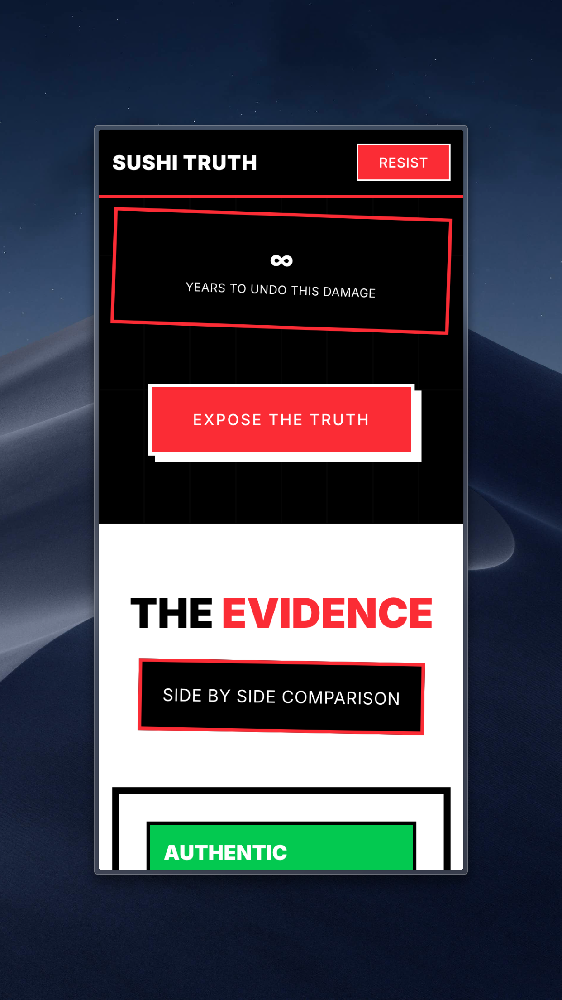
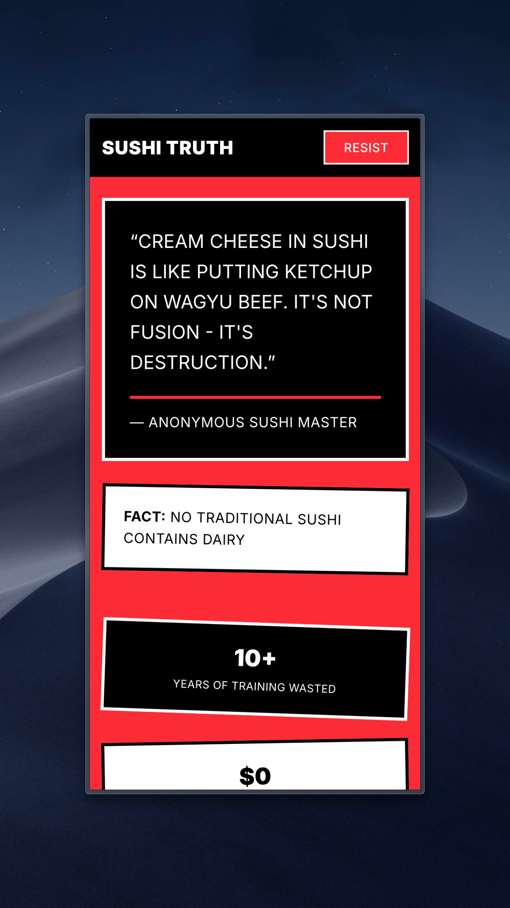
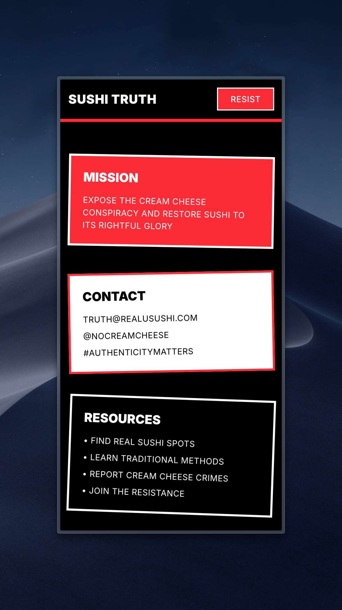
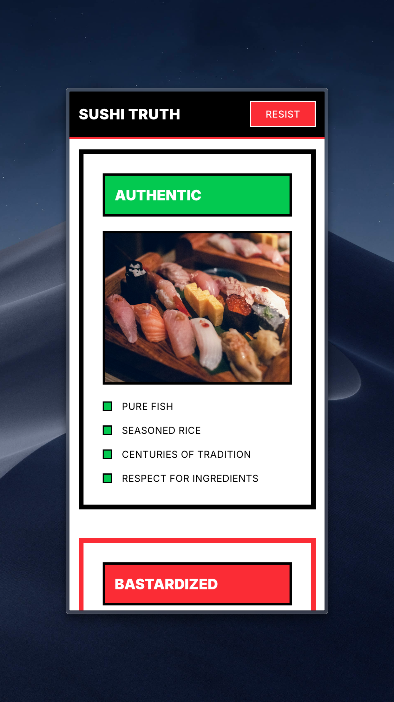

# Sushi Truth - Cream Cheese Killed Sushi

A bold, neo-brutalist website exposing the systematic destruction of Japanese culinary artistry through the cream cheese conspiracy.

<div align="center">
  


</div>

---

## 📸 Mobile Screenshots

<div align="center">

<p>



</p>

<p>


</p>

*Fully responsive design across all mobile devices*

</div>

---

## 🎨 Design Philosophy

This project uses a **neo-brutalist design system** featuring:

- **Bold Typography**: Inter font (400, 700, 900 weights) with heavy uppercase text
- **High Contrast**: Stark black, white, and vibrant red color palette (21:1 contrast ratio)
- **Thick Borders**: 2px, 4px, and 8px borders for visual emphasis
- **Rotated Elements**: Dynamic, tilted cards for visual interest
- **Box Shadows**: Hard, offset shadows for depth without blur
- **Uncompromising Attitude**: Direct messaging with maximum impact

## 🛠️ Tech Stack

- **Framework**: [Next.js 15](https://nextjs.org/) with App Router & Turbopack
- **Language**: [TypeScript](https://www.typescriptlang.org/)
- **Styling**: [Tailwind CSS 4](https://tailwindcss.com/)
- **Font**: [Inter](https://rsms.me/inter/) (Google Fonts)
- **Testing**: [Jest](https://jestjs.io/) + [React Testing Library](https://testing-library.com/react)
- **Linting**: [ESLint](https://eslint.org/) with Next.js config

## 📁 Project Structure

```
ban-cream-cheese/
├── app/
│   ├── components/
│   │   ├── layout/          # Navigation and layout components
│   │   │   ├── __tests__/   # Component tests
│   │   │   └── navigation.tsx
│   │   ├── sections/        # Page sections (Hero, Evidence, etc.)
│   │   │   ├── __tests__/   # Component tests
│   │   │   ├── hero-section.tsx
│   │   │   ├── evidence-section.tsx
│   │   │   ├── chef-testimony.tsx
│   │   │   └── footer-section.tsx
│   │   └── ui/              # Reusable UI components
│   │       ├── __tests__/   # Component tests
│   │       ├── stat-card.tsx
│   │       ├── rotated-card.tsx
│   │       ├── cta-button.tsx
│   │       ├── section-header.tsx
│   │       ├── section-container.tsx
│   │       ├── image-with-fallback.tsx
│   │       └── index.ts     # Barrel exports
│   ├── lib/                 # Utility functions and constants
│   │   ├── __tests__/       # Unit tests
│   │   ├── constants.ts     # App-wide constants (URLs, IDs)
│   │   ├── utils.ts         # Helper functions (cn, smoothScrollTo)
│   │   └── index.ts         # Barrel exports
│   ├── globals.css          # Global styles and Tailwind config
│   ├── layout.tsx           # Root layout with metadata
│   └── page.tsx             # Main landing page
├── public/                  # Static assets
├── jest.config.ts           # Jest configuration
├── jest.setup.ts            # Test setup and mocks
├── tsconfig.json            # TypeScript configuration
├── tailwind.config.ts       # Tailwind CSS configuration
├── eslint.config.mjs        # ESLint configuration
└── package.json             # Dependencies and scripts
```

## 🚀 Getting Started

### Prerequisites

- Node.js 18.x or later
- npm or pnpm

### Installation

1. Clone the repository:
```bash
git clone <repository-url>
cd ban-cream-cheese
```

2. Install dependencies:
```bash
npm install
```

3. Run the development server:
```bash
npm run dev
```

4. Open [http://localhost:3000](http://localhost:3000) in your browser.

## 📝 Scripts

- `npm run dev` - Start development server with Turbopack
- `npm run build` - Build for production
- `npm start` - Start production server
- `npm run lint` - Run ESLint
- `npm test` - Run all tests
- `npm run test:watch` - Run tests in watch mode
- `npm run test:coverage` - Run tests with coverage report

## 🎯 Features

### User Experience
- ✅ **Responsive Design**: Fully responsive across all device sizes
- ✅ **Smooth Scrolling**: Seamless navigation between sections
- ✅ **Image Fallbacks**: Graceful handling of failed image loads
- ✅ **Lazy Loading**: Native lazy loading for images

### Performance ⚡
- ✅ **120 KB First Load JS**: Optimized bundle size
- ✅ **Static Generation**: Pre-rendered for maximum speed
- ✅ **Font Optimization**: Reduced weights + display: swap
- ✅ **Modern Formats**: AVIF/WebP support

### Accessibility ♿
- ✅ **WCAG 2.1 AA Compliant**: Full accessibility support
- ✅ **Keyboard Navigation**: Complete keyboard support
- ✅ **Screen Reader**: Compatible with all screen readers
- ✅ **Focus Indicators**: Visible focus states
- ✅ **Skip Links**: Skip to main content

### Code Quality
- ✅ **Type Safety**: Full TypeScript coverage
- ✅ **Comprehensive Testing**: 139 tests with 97% coverage
- ✅ **ESLint**: Zero linting errors
- ✅ **Reusable Components**: Modular UI component library

## 🧩 Component Architecture

### Layout Components
- **Navigation**: Fixed top navigation with smooth scroll links

### Section Components
- **HeroSection**: Main hero with dramatic headline and statistics
- **EvidenceSection**: Side-by-side comparison of traditional vs. cream cheese sushi
- **ChefTestimony**: Expert testimony and compelling facts
- **FooterSection**: Mission statement, contact info, and resources

### Reusable UI Components
- **StatCard**: Display statistics with configurable variants (dark/light/red)
- **RotatedCard**: Flexible card container with rotation and borders
- **CTAButton**: Consistent call-to-action buttons with hover effects
- **SectionHeader**: Standardized section headers with titles and subtitles
- **SectionContainer**: Layout wrapper for consistent section structure
- **ImageWithFallback**: Robust image component with error handling

## 🧪 Testing

This project maintains high test coverage with comprehensive unit and component tests.

### Test Statistics

- **Test Suites**: 13 passed
- **Total Tests**: 139 passed
- **Coverage**: 97.14%
  - Statements: 97.14%
  - Branches: 89.28%
  - Functions: 100%
  - Lines: 97.14%

### Test Structure

All components have corresponding test files in `__tests__/` directories:

- **Unit Tests**: `app/lib/__tests__/utils.test.ts`
- **UI Component Tests**: `app/components/ui/__tests__/*.test.tsx`
- **Section Component Tests**: `app/components/sections/__tests__/*.test.tsx`
- **Layout Component Tests**: `app/components/layout/__tests__/*.test.tsx`

### Running Tests

```bash
# Run all tests
npm test

# Run tests in watch mode (for development)
npm run test:watch

# Generate coverage report
npm run test:coverage
```

### Testing Tools

- **Jest**: Test runner and assertion library
- **React Testing Library**: Component testing utilities
- **@testing-library/jest-dom**: Custom matchers for DOM assertions

## 🎨 Customization

### Colors

The color palette is defined in `app/globals.css`:
- **Black**: `#000000` - Primary dark color
- **White**: `#ffffff` - Primary light color  
- **Red**: `#ef4444` (Tailwind red-500) - Accent color
- **Green**: `#22c55e` (Tailwind green-500) - Success/authentic indicator

### Typography

The site uses the Inter font family with optimized weights:
- 400 (Regular)
- 700 (Bold)
- 900 (Black)

*Reduced from 6 to 3 weights for better performance (~60 KB savings)*

### Spacing

Follows Tailwind's default spacing scale (0.25rem increments).

## 📄 License

Private project - All rights reserved.

## ⚠️ Disclaimer

This website is a satirical art project meant to provoke thought about cultural authenticity and fusion cuisine. The opinions expressed are exaggerated for comedic and artistic effect.